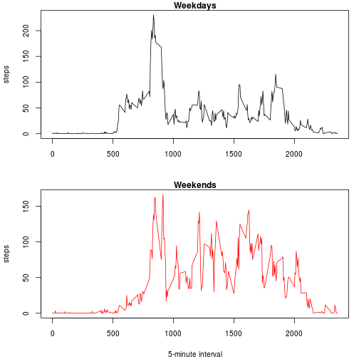

## Loading and preprocessing the data
The program checks whether the file **activity.csv** exists in the working directory. If not, it unzips the zip file located in the directory where data files are stored. Then, the file is loaded into R and the resulting data frame is attached to the search list.


```r
dir <- getwd()
file <- paste0(dir, "/activity.csv")
zipfile <- "repdata_data_activity.zip"
if (!exists(file)) unzip(paste0(dir, "/data/", zipfile), exdir = dir)
activity <- read.csv(file)
```

## What is mean total number of steps taken per day?
Now the number of steps for each day is calculated. The plot shows a histogram of the frequency values of this variable. 


```r
day_steps <- aggregate(activity$steps, by = list(activity$date), FUN = sum, na.rm = TRUE)
names(day_steps) <- c("date", "steps")
with(day_steps, hist(steps, xlab = "steps per day", ylab = "number of days"))
```

 

The mean and median of the total number of steps during a day are calculated: 


```r
mean_steps <- mean(day_steps$steps)
median_steps <- median(day_steps$steps)
```

The mean value is 9354.2295 steps and the median value is 10395 steps. 

## What is the average daily activity pattern?
The number of steps is grouped in 5-minute intervals. The average number of steps in each interval is displayed below.


```r
interval_steps <- aggregate(activity$steps, by = list(activity$interval), FUN = mean, na.rm = TRUE)
names(interval_steps) <- c("interval", "steps")
with(interval_steps, plot(steps ~ interval, type = "l", main = "Steps in 5-minutes intervals"))
```

 

```r
max_steps <- max(interval_steps$steps)
max_interval <- interval_steps$interval[which(interval_steps$steps == max_steps)]
```

As can be seen in the plot, the time interval with the maximum average number of steps (206.1698) is 835.

## Imputing missing values

```r
na_count <- sum(is.na(activity$steps))
```
The full dataset has 2304 rows with missing values (NA). In order to get rid of them, they are assigned the mean value for the corresponding interval: 


```r
activity$steps[is.na(activity$steps)] <- as.integer(interval_steps$steps)
```

It is worth noticing that the last assignment is performed in a very simple step because all NA values are grouped in full days. Otherwise care should be taken that the correct interval is chosen every time. 

With the new complete dataset the total number of steps per day is calculated again and displayed in a histogram.


```r
day_steps2 <- aggregate(activity$steps, by = list(activity$date), FUN = sum, na.rm = TRUE)
names(day_steps2) <- c("date", "steps")
with(day_steps2, hist(steps, xlab = "steps per day (2)", ylab = "number of days"))
```

 

```r
mean_steps2 <- mean(day_steps2$steps)
median_steps2 <- median(day_steps2$steps)
```

The mean and median value of total steps per day are now 10749.7704918033 and 10641 steps. As the plot already made clear, the data manipulation changed both values. 

## Are there differences in activity patterns between weekdays and weekends?
After making sure that the day names are in English, a factor column is created with the values *weekday* and *weekend*.


```r
Sys.setlocale("LC_TIME","en_US.utf8")   # make sure days are in English
```

```
## [1] "en_US.utf8"
```

```r
activity$day <- factor(ifelse(weekdays(as.Date(activity$date)) %in% c("Saturday", "Sunday"), "weekend", "weekday"))
```

Now the average number of steps per interval is calculated again, but splitting the data from weekdays and weekends.


```r
interval_steps_day <- aggregate(activity$steps, by = list(activity$interval, activity$day), FUN = mean, na.rm = TRUE)
names(interval_steps_day) <- c("interval", "day", "steps")
```

So that the number of steps per interval can be plotted for the two day groups.


```r
week <- interval_steps_day$day == "weekday"
par(mfcol = c(2,1), mar = c(4, 4, 1, 1), ps = 10)
with(interval_steps_day, {
    plot(steps[week] ~ interval[week],  col = "Black", type = "l", main = "Weekdays", xlab = "", ylab = "steps")
    plot(steps[!week] ~ interval[!week], col = "Red", type = "l", main = "Weekends", xlab = "5-minute interval", ylab = "steps")
})
```

 

According to the figures, activity on weekdays is higher in the morning, before 10 am, and especially before 8 am. After that time, activity in the weekend is on average higher.
